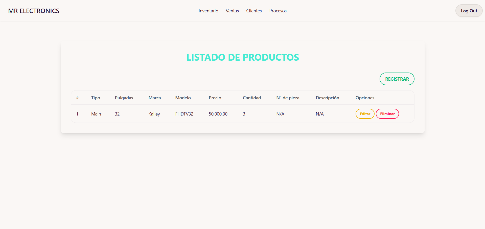
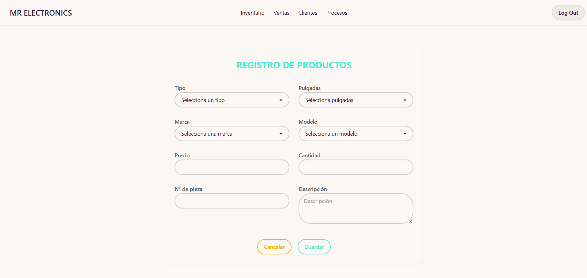
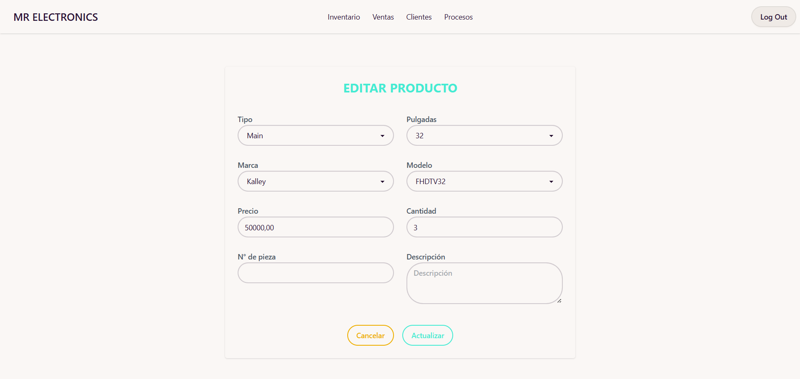
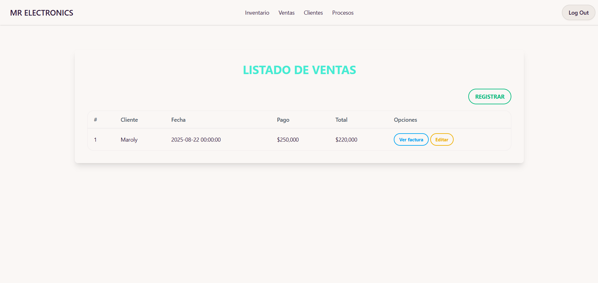
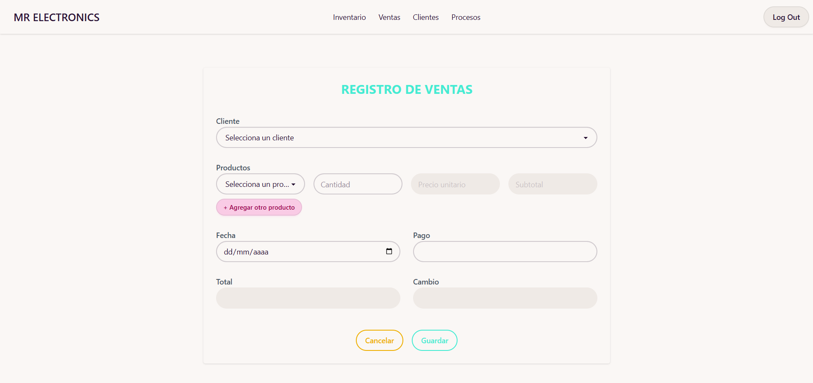
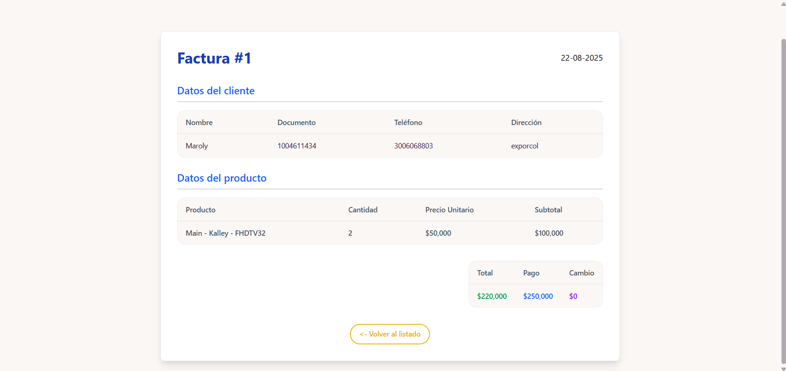
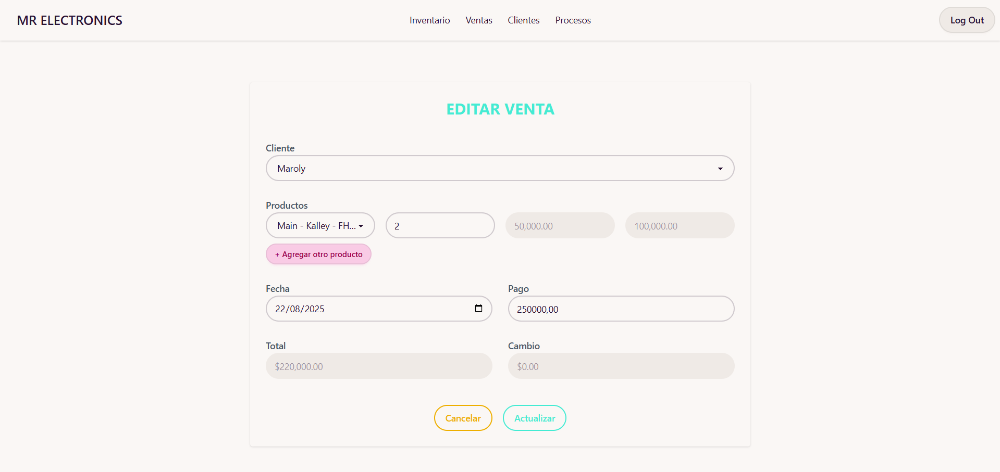
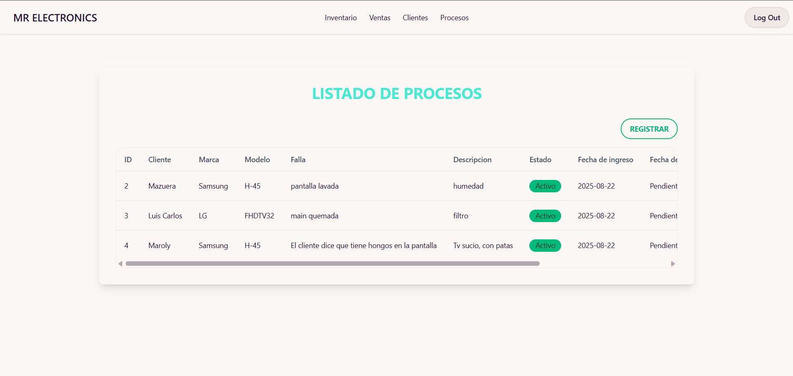
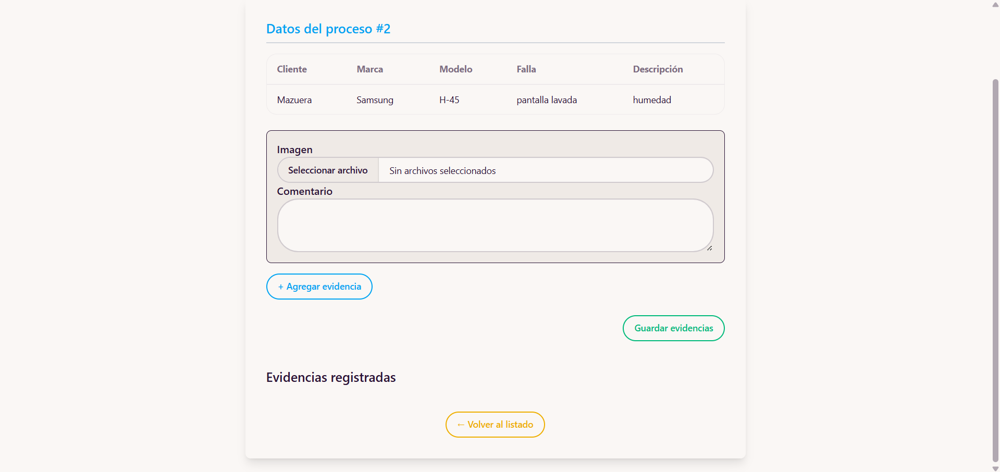

# 👨🏼‍🔧 MR ELECTRONICS

> *MR Electrónics es un sistema web moderno para negocios de electrónica que integra inventario, ventas y reparaciones en una sola plataforma eficiente y segura. 🚀*

MR Electrónics es un sistema web integral desarrollado en Laravel con PostgreSQL, diseñado para optimizar la gestión de inventario, ventas y reparaciones de equipos electrónicos. Su interfaz moderna y responsiva, potenciada con DaisyUI, permite un manejo ágil de productos, clientes y servicios, incluyendo la creación dinámica de registros sin interrumpir los flujos de trabajo. El sistema ofrece un control completo de inventario, permitiendo registrar productos con atributos detallados como tipo, marca, modelo, precio, número de pieza y descripción, así como gestionar clientes y su historial de compras. Las ventas se registran con detalle y permiten generar facturas electrónicas, mientras que los procesos de reparación incorporan seguimiento completo de equipos, registro de fallas, comentarios técnicos y evidencias fotográficas. MR Electrónics garantiza eficiencia operativa, trazabilidad de información y escalabilidad, posicionándose como una solución confiable y moderna para negocios dedicados a la venta y mantenimiento de productos electrónicos.

---

## 🎯 Objetivos

- Optimizar la gestión de inventario de productos electrónicos, asegurando control de stock y trazabilidad de cada artículo.
- Facilitar el registro y seguimiento de ventas y facturación de manera eficiente y confiable.
- Gestionar procesos de reparación con registro de fallas, seguimiento de clientes y evidencias de trabajos realizados.
- Proporcionar una interfaz intuitiva y dinámica que agilice los procesos administrativos del negocio.
- Garantizar escalabilidad y seguridad en la gestión de información empresarial.

---

## 🎯 Misión

Proveer una plataforma tecnológica integral que permita a negocios de electrónica gestionar inventario, ventas y reparaciones de manera eficiente, segura y moderna, optimizando los procesos internos y mejorando la experiencia de clientes y colaboradores.

---

## 🎯 Visión

Ser la solución líder en sistemas de gestión para negocios de electrónica en la región, reconocida por su innovación, confiabilidad y capacidad de adaptación a las necesidades de los usuarios, contribuyendo a la transformación digital de pequeñas y medianas empresas.

---

# 👨🏼‍💻 Tecnologías utilizadas

- 
- 
- 
- 
- 

---

## ✨ Características clave

- ✅ Registro completo de productos: tipo, marca, modelo, precio, número de pieza y descripción.
- ✅ Gestión dinámica de clientes: crear clientes nuevos sin salir del flujo de ventas o inventario.
- ✅ Control de inventario: seguimiento de stock en tiempo real.
- ✅ Registro de ventas y facturación: visualización de facturas detalladas por cliente y producto.
- ✅ Procesos de reparación: seguimiento completo de fallas, comentarios técnicos y evidencias fotográficas.
- ✅ Interfaz responsiva y moderna: diseño intuitivo con DaisyUI, adaptable a cualquier dispositivo.
- ✅ Escalable y seguro: preparado para crecer con el negocio y proteger la información.

---

# 🖥️ Capturas de pantalla

## Inventario

### Index de Productos

### Formulario de Registro 

### Formulario de Edit

## Ventas

### Index de Ventas

### Registro de ventas

### Factura de ventas

### Edit de ventas

## Procesos

### Index de Procesos

### Evidencias de Procesos

